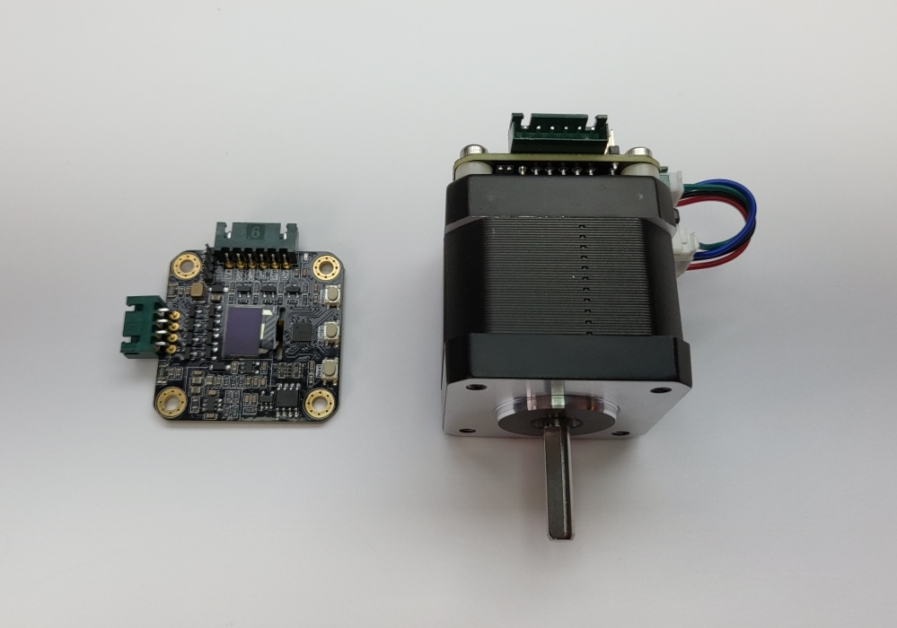
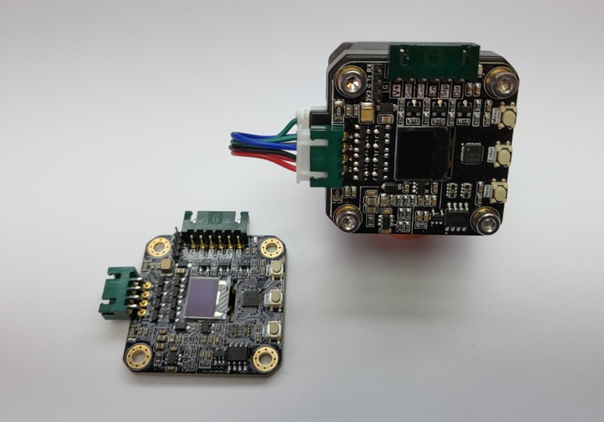

# MKS-SERVO42C-Library

Control MKSServo42c Servos via serial port and dotnet 

## Hardware

The MKS SERVO42C PCBA is a Nema 17 stepper motor, 32bit ARM Servo Close Loop SMT32 Controller.

    
    

It can be bought 

[as a single board to attach to a existing motor](https://amzn.to/3D92YM2) 

or

[as a set completely assembled including motor](https://amzn.to/3J9w4yF)

## Usage

~~~csharp
using Mks.Servo42c;

var control = new MksServo42cControl();
if (control.Open("COM6", baud: MotorParameters.UartBauds.b38400) == false)
    throw new Exception("Can't open port");

const byte motorIndex = 0;

await control.EnableDriver(motorIndex: motorIndex, enable: true);

await control.MoveMotorByPulse(motorIndex: motorIndex, speed: 5, forward: true, pulse: (uint)1000);
await control.StartMovement(motorIndex: motorIndex, forward: true, speed: 4);
~~~